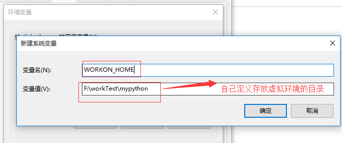
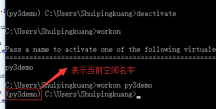
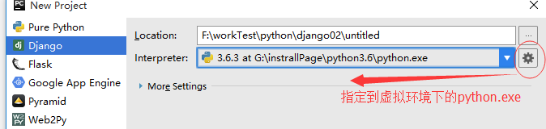

## <center>window系统下python虚拟空间的配置</center>

>之前作为菜鸟的我,从来不知道创建虚拟环境来开发`python`,都是使用全局的来开发项目,这样最后的结果是,所有的包全部安装在全局,也不能有好的在切换`py2`中切换,现在讲解在widow下使用虚拟环境来开发`python`项目就可以解决这个问题。

一、使用步骤

* 1、安装`virtualenvwrapper`

    ```python
     # window下  
     pip install virtualenvwrapper-win
     # linux下
     pip install virtualenvwrapper
    ```
    
* 2、配置电脑上存放虚拟环境的目录(注意配置后要退出黑窗口)

    
    
* 3、使用`virtualenvwrapper`创建虚拟环境

    ```python
    mkvirtualenv py3demo
    ```
    
* 4、指定`python`版本

    ```python
    mkvirtualenv --python=[你安装python版本文件目录\python.exe] 空间名
    ```
    
* 5、常用的空间命令

    * `workon`查看全部的空间
    * `workon [空间名]`进去那个空间
    * `deactivate`退出当前空间

    
    
* 6、`pycharm`使用虚拟环境下的`python`开发项目(以`django`讲解)[在`Scripts`目录下]
    

### 二、补充说明
>有时候我们使用`pip install`安装包的时候比较慢,可以选用国内镜像来安装,类似`npm`改用淘宝镜像一样的,[传送门](https://www.cnblogs.com/wooya/p/6371511.html),但是不推荐全局配置,有些最新的包,国内镜像源可能没有收录
