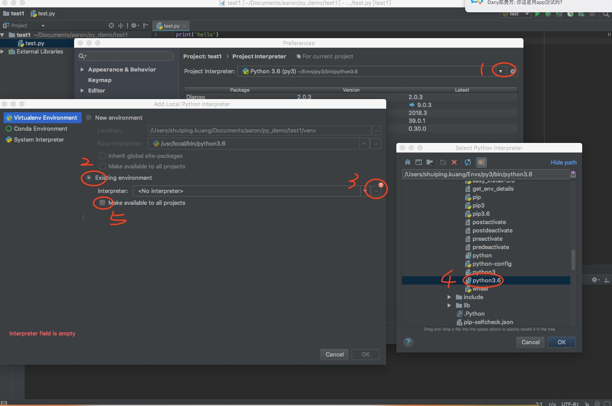

## <center>mac系统下python虚拟空间的配置</center>


### `mac`使用`python3`构建项目
* 1、根据上面的方式测试安装成功
  > 根据上一章节的方式我们已经在电脑上安装了`python>3.5`,下面介绍如何在`mac`上配置虚拟空间

* 2、创建虚拟空间
	* 安装基础包
	
		```python
		pip3 install virutalenv virtualenvwrapper		``` 
		
	* 基础配置
	
		```python
		mkdir -p $WORKON_HOME
		```
		
	* 配置环境变量(`vim ~/.bash_profile`直接把下面两行添加到文件中)

		```python
		export WORKON_HOME=~/Envs
		source /usr/local/bin/virtualenvwrapper.sh
		```
	* 创建一个虚拟环境并制定`python3`版本

		```python
		mkvirtualenv虚拟环境名字 --python=python3.6
		# 查看python版本
		python --version
		```
	* 关于虚拟环境的几个命令

		```python
		# 创建一个环境
		mkvirtualenv 名称 --python=python3.6
		# 查看全部的环境
		workon
		# 进入那个环境
		workon 环境名称
		# 退出一个环境
		deactivate
		# 删除一个环境
		rmvirtualenv 环境名称
		```
	
	* 安装的虚拟环境的位置

		```python
		/Users/mac电脑名/Envs
		```
		
* 3、在`pycharm`中使用自己的虚拟环境
	