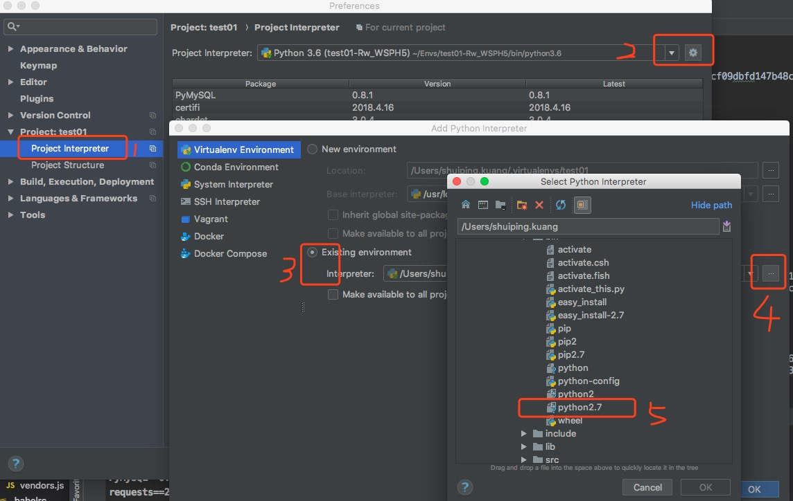

##<center>pipenv包管理工具的使用</center>

### 一、`pipenv`的认识
---

`pipenv` 是 `python` 官方推荐的包管理工具，集成了 `virtualenv`、`pyenv` 和 `pip` 三者的功能于一身,有点类似`nodejs`中的`package.json`一样的,会把依赖的包锁住到指定的版本。


pipenv 主要解决了以下问题：

* 不用再单独使用 virtualenv、pyenv 和 pip 了，现在它们结合到了一起。
* 不用再维护 requirement.txt 了，使用 Pipfile 和 Pipfile.lock 来代替。
* 可以在开发环境使用多个 python 版本。
* 在安装的 pyenv 条件下，可以自动安装需要的 python 版本。
* 安全，广泛地使用 Hash 校验，能够自动曝露安全漏洞。
* 随时查看图形化的依赖关系。


### 二、安装

* 1、通过`pip`安装

  ```py
  pip install pipenv
  ```

* 2、`brew`安装

  ```py
  brew install pipenv
  ```

### 三、常见的命令

* 1、安装包

  ```py
  # 安装python3.6
  pipenv install --python 3.6  
  # 安装包
  pipenv install requests
  ```

* 2、卸载包

  ```py
  pipenv uninstall 包名
  ```

* 3、查看依赖包

  ```py
  pipenv graph
  ```

* 3、进入虚拟空间

  ```py
  # 进入及显示当前虚拟环境的目录
  pipenv shell 
  # 查看虚拟空间
  workon
  # 
  ```

* 4、退出虚拟空间

  ```py
  exit
  # 这个也可以
  deactivate
  ```

* 5、删除虚拟环境(当前环境下)

  ```py
  pipenv --rm
  ```

### 四、使用步骤

* 1、创建一个文件夹
* 2、初始化项目

  ```py
  pipenv install --python 版本号(大致就可以)
  ```
* 3、使用`pipenv shell`进入虚拟环境
* 4、安装依赖包

### 五、`pycharm`中集成`pipenv`的空间

* 1、用`pycharm`打开刚刚创建的文件夹
* 2、`pycharm`如下图配置

  


### 六、如果你的`mac`电脑或者`linux`系统的时候开业配置自动补全

请把如下语句追加到`.bashrc`或者`.zshrc`即可：

```js
eval "$(pipenv --completion)"
```


