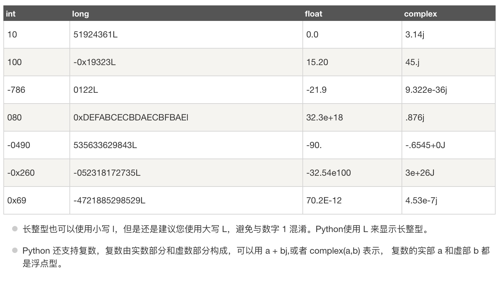

## <center>数字类型</center>

### 一、数字类型包括以下几种

* 1、`int`（有符号整型）
* 2、`long`（长整型[也可以代表八进制和十六进制]）
* 3、`float`（浮点型）
* 4、`complex`（复数）

  > 关于几种类型的对比

  

### 二、数字类型的定义

* 1、定义

  ```py
  num1 = '10'
  # 是一个字符类型
  print(type(num1))
  num2 = 10
  # 是一个数字类型
  print(type(num2))
  ```