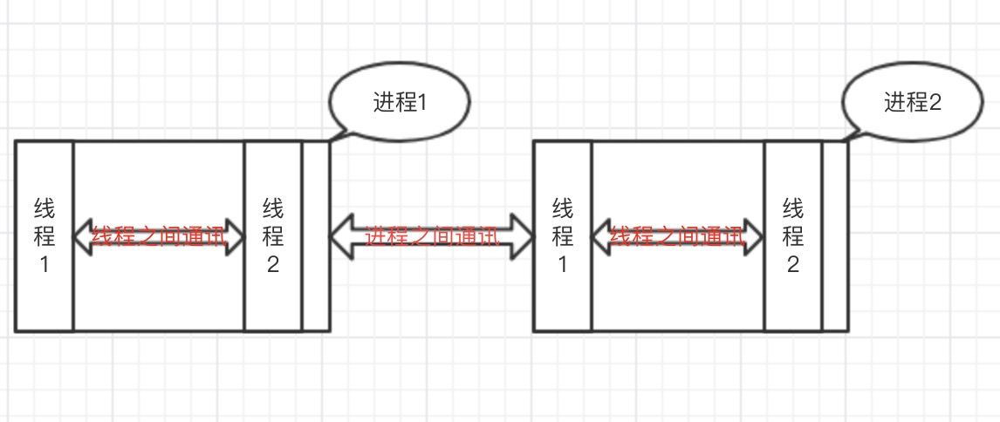

## <center>关于进程和线程的认识</center>

#### 介绍:`python`中跟别的语言不一样的即使自己不加锁也有个全局的锁`GIL`,因为有全解锁的存在造成`python`只能是单线程操作(一个进程里面可以多个线程,但是同时执行的时候只有一个线程),在现在多核处理的时代,我们只使用单线程,与`java`对比,似乎不能最大的使用`CPU`,这就是我们说的`python`中的一个`BUG`'

### 一、进程和线程的认识
* 1、进程和线程的关系

* 2、`python`中一个进程里面可以创建多个线程,但是由于`GIL`锁的缘故,在同一进程同一时刻,只能执行一个线程,进程中的多线程,会不停的切换。


### 二、创建线程的两种方式
* 1、直接创建方式

	```python
	import threading
	import time
	
	def hi(num):
	    print('hello %d' % num)
	    time.sleep(3)
	
	if __name__ == "__main__":
	    print('主线程开始')
	    # 使用threading模块创建一个多线程,target表示目标函数,args是一个传递参数的元祖
	    t1 = threading.Thread(target=hi, args=(10,))
	    # 启动一个线程
	    t1.start()
	
	    t2 = threading.Thread(target=hi, args=(20,))
	    t2.start()
	    print('主线程结束了')
	```
* 2、使用类继承方式创建线程

	```python
	import threading
	import time
	
	class MyThread(threading.Thread):
	    def __init__(self, num):
	        threading.Thread.__init__(self)
	        self.num = num
	
	    def run(self):
	        print('当前的数字: %d' % self.num)
	        time.sleep(3)
	
	class MyThread1(threading.Thread):
	
	    def run(self):
	        time.sleep(5)
	
	if __name__ == "__main__":
	    print('主线程开始')
	    t1 = MyThread(1)
	    t2 = MyThread(2)
	    t1.start()
	    t2.start()
	    print('主线程结束')
	```
* 3、习惯性创建多线程的方式
> 上面方法是一个一个的创建一个一个的启动,如果多了就很被动

	```python
	...
	l = []
	for i in range(100):
	    t = threading.Thread(target=sub)
	    t.start()
	    l.append(t)
	....
	```

### 三、`JOIN`的使用
> 在`python`线程中`join`可以理解为把线程添加到一个队列里,然后根据队列的先进先出的原则,顺序的执行。

* 1、不使用`join`

	```python
	import threading
	import time
	
	def music():
	    print('在听音乐')
	    time.sleep(3)
	
	def game():
	    print('在玩游戏')
	    time.sleep(5)
	
	if __name__ == "__main__":
	    print('主线程开始')
	    t1 = threading.Thread(target=music)
	    t2 = threading.Thread(target=game)
	
	    # 启动线程
	    t1.start()
	    t2.start()
	    # t1.join()
	    # t2.join()
	    print('主线程结束')
	```
* 2、运行后马上执行完成,等待5s程序结束
* 3、使用`join`

	```python
	import threading
	import time
	
	def music():
	    print('在听音乐')
	    time.sleep(3)
	
	def game():
	    print('在玩游戏')
	    time.sleep(5)
	
	if __name__ == "__main__":
	    print('主线程开始')
	    t1 = threading.Thread(target=music)
	    t2 = threading.Thread(target=game)
	
	    # 启动线程
	    t1.start()
	    t2.start()
	    t1.join()
	    t2.join()
	    print('主线程结束')
	```
* 4、等待5s后打印(主线程结束)程序结束

### 四、线程守护
> 所谓的线程守护:**主线程结束后,被守护的线程会跟着主线程一起结束**,注意点:**线程守护要写在线程启动之前**

* 1、具体实现代码

	```python
	import threading
	import time
	
	def music():
	    print('听音乐')
	    time.sleep(3)
	    print('听音乐2')
	
	def game():
	    print('玩游戏')
	    time.sleep(5)
	    print('玩游戏2')
	
	threads = []
	
	t1 = threading.Thread(target=music)
	t2 = threading.Thread(target=game)
	
	threads.append(t1)
	threads.append(t2)
	
	if __name__ == '__main__':
	    """
	    t2线程中会等主线程结束也就结束，不会打印玩游戏2
	    """
	    t2.setDaemon(True)
	    print('主线程开始')
	    for t in threads:
	        t.start()
	    print('主线程结束')
	```
	
### 五、并发与并行的认识
* 并发:是指系统具有处理多个任务(动作)的能力
* 并行:是指系统具有**同时**处理多个任务(动作)的能力

### 六、多进程操作
> 上面讲到的`python`是单线程操作的,在现在多核处理器的时代,`python`似乎就有点浪费资源,如果有需要可以开多进程(比如你的处理器是四核,如果开了5个进程,那么一核里面分配一个进程,多余的那个等待,那个进程执行完成,再分配)

### 七、创建多进程的方法
* 1、普通的创建方式

	```python
	from multiprocessing import Process
	import time
	
	def f(name):
	    time.sleep(1)
	    print('hello', name, time.ctime())
	
	if __name__ == '__main__':
	    p_list = []
	    # 开3个进程
	    for i in range(3):
	        p = Process(target=f, args=(i,))
	        p_list.append(p)
	
	    for p in p_list:
	        p.start()
	
	    print('结束了')
	```

* 2、使用类继承方式来创建

	```python
	from multiprocessing import Process
	import time
	
	class MyProcess(Process):
	    def __init__(self, name):
	        super().__init__()
	        self.name = name
	
	    def run(self):
	        time.sleep(1)
	        print('hello', self.name, time.ctime())
	
	if __name__ == "__main__":
	    p_list = []
	    # 开3个进程
	    for i in range(3):
	        p_list.append(MyProcess(str(i)))
	
	    for p in p_list:
	        p.start()
	
	    print('结束了')
	```
* 3、发现创建进程和创建线程是一样的
* 4、关于守护进程(与线程有点区别)

	```python
	...
	if __name__ == "__main__":
	    p_list = []
	    # 开3个进程
	    for i in range(3):
	        p_list.append(MyProcess(str(i)))
	
	    for p in p_list:
	        p.daemon = True
	        p.start()
	
	    print('结束了')
	```


